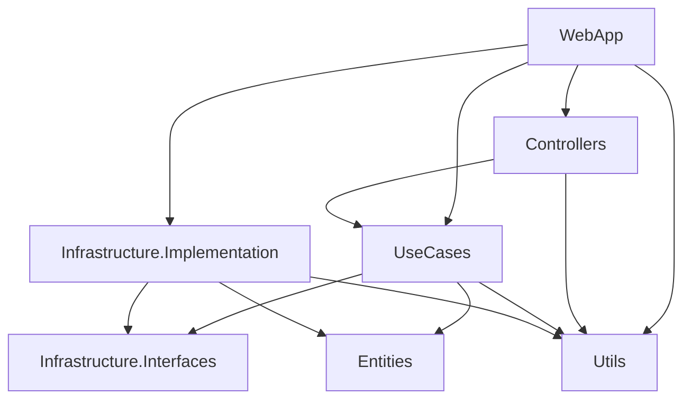

# Требования к архитектуре приложения backend

Целевая структура backend-сервисов в духе чистой архитектуры: слои, сборки и правила зависимостей. Шаблон имён сборок и нумерация согласованы с общим документом [assemblies.md](assemblies.md). Текущая реализация в репозитории может отставать от этой спеки — структура ниже задаёт **целевой** эталон при развитии сервиса.

## Структура папок и сборок

В корне сервиса создаются папки с фиксированным префиксом номера. Имя каждой сборки следует шаблону из [assemblies.md](assemblies.md): `<Prefix>.<НазваниеСервиса>.<Назначение>` (пример: `<Prefix>.WebApi.Entities`, `<Prefix>.WebApi.DataAccess.Postgres`).

| № | Папка | Сборка (пример назначения) | Краткое назначение |
|---|--------|----------------------------|-------------------|
| 0 | `0 Utils` | `<Prefix>.<Сервис>.Utils` | Общие методы, расширения, вспомогательные типы без привязки к сценариям |
| 1 | `1 Entities` | `<Prefix>.<Сервис>.Entities` | Доменные сущности, value objects |
| 2 | `2 Infrastructure.Interfaces` | `<Prefix>.<Сервис>.DataAccess.Interfaces`, `<Prefix>.<Сервис>.RabbitMQ.Interfaces` | Абстракции персистентности, messaging, внешних API |
| 3 | `3 UseCases` | `<Prefix>.<Сервис>.UseCases` | Сценарии приложения, CQRS (команды/запросы, обработчики) |
| 4 | `4 Controllers` | `<Prefix>.<Сервис>.Controllers` | HTTP-контроллеры при вынесении из WebApp (опционально) |
| 5 | `5 Infrastructure.Implementation` | `<Prefix>.<Сервис>.DataAccess.Postgres`, `<Prefix>.<Сервис>.RabbitMQ.Implementation` | Реализации абстракций §2 |
| 6 | `6 WebApp` | `<Prefix>.<Сервис>.WebApp` | Точка входа ASP.NET, DI, middleware, OpenAPI |
| 7 | `7 Tests` | `<Prefix>.<Сервис>.Tests` | Автотесты |

**Вариант упрощения (§2).** Вместо отдельных сборок `DataAccess.Interfaces` и `RabbitMQ.Interfaces` допускается один проект `<Prefix>.<Сервис>.Infrastructure.Interfaces`, объединяющий все абстракции инфраструктуры, если команде не нужно разделять границы по технологиям. Для сервисов с PostgreSQL и RabbitMQ каноном остаётся раздельное разбиение из таблицы выше.

## Правила зависимостей (граф)

Стрелка означает «слой **использует** (ссылается на) нижележащий».



Если сборка `Controllers` не выделяется, на схеме нет узла `Controllers` и связи `WebApp` → `Controllers`: `WebApp` напрямую содержит minimal API или контроллеры и ссылается на `UseCases` и `Infrastructure.Implementation`.

**Профиль по умолчанию.** Для новых сервисов в этом репозитории **по умолчанию** HTTP-слой (контроллеры ASP.NET Core и/или minimal API) размещается **внутри** сборки `6 WebApp`. Отдельная сборка `4 Controllers` подключается только при явном архитектурном обосновании (разные клиенты с отличающимся HTTP-слоем, независимые релизные циклы, выделенный контракт API).

---

### 0 Utils

**Назначение.** Сборка с переиспользуемыми расширениями, guard-утверждениями, маппингом без доменной логики сценария.

**Зависимости.** Предпочтительно только BCL; ссылка на `Entities` допускается только для узких расширений над типами сущностей (избегать разрастания).

**Примеры типов.** Статические `*Extensions`, `ArgumentGuard`, общие константы ошибок.

---

### 1 Entities

**Назначение.** Доменная модель: сущности, enums домена, value objects. **Rich model:** инварианты и поведение внутри типов, без интерфейсов репозиториев и без обращения к БД.

**Зависимости.** Не ссылается на другие проекты сервиса (кроме при необходимости `Utils` для чисто технических хелперов — по согласованию в команде).

**Примеры типов.** `ExampleItem`, `Order` (агрегаты/сущности по выбранной модели).

---

### 2 Infrastructure.Interfaces

**Назначение.** Контракты выхода наружу: БД, очередь, HTTP-клиенты к внешним системам, `ICurrentUser` и т.п.

**Зависимости.** Ссылается на `Entities` при типах в сигнатурах. Ссылка на **Microsoft.EntityFrameworkCore** здесь — **осознанное отклонение** от «строгой» чистой архитектуры: допускается, если контракты персистентности выражены с участием типов EF (например абстракция вокруг `DbContext`). Альтернатива без EF в этом проекте — перенос низкоуровневых контрактов ближе к `UseCases` и оставление в `Infrastructure.Interfaces` только технически нейтральных интерфейсов; выбор фиксируется на уровне сервиса и не смешивается в одном решении произвольно.

**Примеры типов.** `IUnitOfWork`, `IExampleRepository`, `IMessagePublisher`, интерфейс доступа к данным поверх ORM.

---

### 3 UseCases

**Назначение.** Прикладные сценарии, разделение команд и запросов (**CQRS**). Оркестрация домена и вызовов к абстракциям из `Infrastructure.Interfaces`.

**Зависимости.** `Entities`, `Infrastructure.Interfaces`, при необходимости `Utils`. Не ссылается на `Infrastructure.Implementation`, `WebApp`, пакеты конкретных драйверов (Npgsql и т.д.).

**Диспетчеризация CQRS.** Для маршрутизации команд и запросов по умолчанию используется **Requestum** (одна библиотека на весь сервис). Пакет: [Requestum](https://www.nuget.org/packages/Requestum/). Регистрация обработчиков выполняется со сборки, где лежат типы сценариев (например `typeof(SomeQuery).Assembly` для `<Prefix>.<Сервис>.UseCases`), а не только со сборки `WebApp`.

**MediatR** допустим как альтернатива там, где приемлема лицензия и команда зафиксировала выбор в README или ADR. В одном сервисе не смешивают два диспетчера без явного решения. Для новых сервисов в этом репозитории дефолт остаётся **Requestum**; смена дефолта — только через отдельный ADR.

**Примеры типов.** Команды/запросы, обработчики (`*Handler`), валидаторы сценариев, DTO входа/выхода сценария.

#### Структура папок `Handlers` (эталон слоя сценариев)

Внутри сборки `<Prefix>.<Сервис>.UseCases` сценарии группируются по **вертикальным срезам** (фича, агрегат или подсистема API).

Корень слоя:

- `Handlers/` — обработчики CQRS и сопутствующие типы сценариев.
- `Exceptions/` (или аналог) — исключения уровня UseCases, общие для нескольких сценариев.

Дерево по одной фиче `<Feature>` (например `Examples`, `Orders`, `Users`):

```text
Handlers/
  <Feature>/
    Commands/
      <UseCaseName>/
        <UseCaseName>Command.cs
        <UseCaseName>CommandHandler.cs
        Requests/
        Dto/
        Responses/
        Validators/           # валидаторы команды (FluentValidation, *Validator)
    Queries/
      <UseCaseName>/
        <UseCaseName>Query.cs
        <UseCaseName>Handler.cs
        Requests/
        Dto/
        Responses/
        Validators/            # валидаторы запроса (*QueryValidator)
    Enums/                    # перечисления, относящиеся к фиче целиком
    Mappings/                 # ручные маппинги между DTO и доменом
```

**Правила.**

- **Один сценарий — одна папка** под `Commands/<UseCaseName>/` или `Queries/<UseCaseName>/`: в ней лежат команда/запрос, обработчик и локальные `Requests`, `Dto`, `Responses`, валидаторы.
- **Именование.** `*Command` + `*CommandHandler`, `*Query` + `*Handler` (или `*QueryHandler` — главное единообразие в решении). Валидаторы FluentValidation: папка `Validators/`, класс `*CommandValidator` или `*QueryValidator`. Ответ API сценария — в `Responses/`; вход контроллера — в `Requests/`, если его нужно отделить от типа команды/запроса.
- **Общее для фичи** (`Enums/`, `Mappings/`) — только то, что реально переиспользуется несколькими сценариями внутри `<Feature>`; иначе тип держится рядом с конкретным сценарием.
- **Пространства имён** следуют пути: `<Prefix>.<Сервис>.UseCases.Handlers.<Feature>.Commands.<UseCaseName>` и зеркально для `Queries`.

Обработчики Requestum (или MediatR при выборе этой библиотеки) размещаются в том же физическом раскладе; отличается только интерфейс обработчика и регистрация в DI.

---

### 4 Controllers

**Назначение.** Отдельная сборка HTTP-слоя, если нужно разделить контракты API (например разные клиенты: мобильное приложение и админка) или упростить версионирование.

**Зависимости.** `UseCases`, `Utils`. Не ссылается на `Infrastructure.Implementation`.

**Уточнение по организации.** Либо один `WebApp` с группами маршрутов и версиями API (`MapGroup`, заголовок версии), либо отдельная сборка `Controllers` на клиент — выбор документируется в README сервиса. Связь с **версионированием API** должна быть явной (префикс маршрута, `ApiVersioning` и т.д.).

**Примеры типов.** `ExamplesController`, фильтры, привязка моделей к командам/запросам Requestum.

**Профиль по умолчанию.** Для большинства сервисов слой HTTP остаётся внутри `6 WebApp` (см. раздел «Профиль по умолчанию» у графа зависимостей). Раздел `4 Controllers` включается только по явному архитектурному решению.

---

### 5 Infrastructure.Implementation

**Назначение.** Реализации из §2: EF Core + PostgreSQL, клиент RabbitMQ, реализации внешних интеграций.

**Зависимости.** `Infrastructure.Interfaces`, `Entities`, `Utils` по необходимости.

**Технологии.** Для PostgreSQL: пакет `Npgsql.EntityFrameworkCore.PostgreSQL` (и связанные версии EF Core). Проект `<Prefix>.<Сервис>.RabbitMQ.Implementation` — конкретные publisher/consumer; при появлении **outbox/inbox** паттерн описывается в документации сервиса (спека допускает расширение без смены нумерации папок).

**Примеры типов.** `AppDbContext`, конфигурации `IEntityTypeConfiguration<>`, `RabbitMqEventPublisher`.

---

### 6 WebApp

**Назначение.** **Composition Root**: регистрация DI, middleware, аутентификация, Swagger/OpenAPI, hosted services. Единственное место, где подключаются реализации из `Infrastructure.Implementation`.

**Зависимости.** `UseCases`, `Infrastructure.Implementation`, при выделении отдельного HTTP-слоя — `Controllers`; `Utils`. Фраза «используется только слой UseCases» означает: **бизнес-операции выполняются только через сценарии UseCases** (в т.ч. через Requestum), а не прямым вызовом `DbContext` из Program/контроллеров. Инфраструктура в WebApp только **регистрируется**, а не содержит сценарной логики.

**Примеры.** `Program.cs`, `Add*`-расширения для DI, регистрация Requestum (сканирование сборки `UseCases`), `MapControllers` / `MapGroup`.

**Версионирование HTTP API (baseline).** Внутренний baseline для сервисов: префикс маршрута `/api/v1` в атрибутах вида `[Route("api/v1/[controller]")]` или в `MapGroup("api/v1")` **без обязательного** подключения пакета `Microsoft.AspNetCore.Mvc.Versioning`. Если выбран иной механизм (заголовок, media type, пакет версионирования), это фиксируется в README сервиса и не смешивается в одном решении без явного решения.

---

### 7 Tests

**Назначение.** Автотесты сервиса: прежде всего **unit**-тесты UseCases и домена с подменами интерфейсов. По необходимости — **integration**-тесты (`WebApplicationFactory`, реальная или тестовая БД), контрактные проверки messaging.

**Зависимости.** Тестовый проект ссылается на тестируемые сборки (`UseCases`, `WebApp`, `Infrastructure.*` — по виду теста).

---

## Кросс-срезовые concern’ы

Логирование, трассировка, correlation id, health checks: конфигурация в **WebApp**; переиспользуемые обёртки и константы — в **Utils**. Детальные стандарты (Serilog/OpenTelemetry и т.д.) выносятся в отдельные спеки или README при появлении реализации.

Рекомендуемый **минимальный baseline** для внутренних API (по мере внедрения в конкретном сервисе репозитория):

- **`X-Correlation-ID`**: принимается от клиента или генерируется на сервере; возвращается в ответе для сквозной трассировки.
- **`X-Api-Key`**: для маршрутов под `/api/v1/*` в средах, отличных от Development, обязателен при включённой в конфигурации политике защиты внутренних вызовов.
- **`GET /health`**: стандартная точка проверки готовности приложения (liveness/readiness по политике развёртывания).

## Concurrency и защита от гонок

Для сценариев с read-then-create/update (например инициализация или выдача ресурса по уникальному ключу) требуется явная стратегия защиты от гонок:

- **Внутри процесса:** допускается локальная сериализация (`SemaphoreSlim` / `lock` по ключу ресурса), когда нужно устранить гонку в рамках одного инстанса.
- **Распределённо:** для нескольких инстансов обязательна защита на уровне БД (уникальные ограничения, повтор при конфликте, upsert, транзакции по политике согласованности).

Выбранный уровень и инструменты фиксируются в README или ADR сервиса и должны соответствовать целевой топологии окружения.
