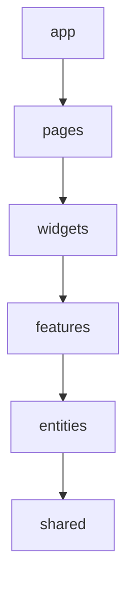

# Требования к архитектуре приложения frontend

Документ задаёт **целевой** эталон организации веб-клиента проекта и соглашения по стеку, маршрутизации и работе с API. Нумерация и связь с общими правилами именования сборок сервисов — в [assemblies.md](../assemblies.md). Слои и зависимости backend-сервисов описаны в [11-backend-app-architecture.md](../backend/11-backend-app-architecture.md) (отдельно от клиента). Текущая реализация в репозитории (проект `cnt_sp_web`) может отставать от этой спеки: структура ниже описывает направление развития, а не обязательное совпадение с деревом файлов в каждом коммите.

Приложение: SPA **`cnt_sp_web`** в каталоге [src/frontend/cnt_sp_web](../../../../src/frontend/cnt_sp_web).

---

## Стек и точка входа

| Компонент | Назначение |
|-----------|------------|
| **React** | UI и композиция экранов |
| **TypeScript** | типизация |
| **Vite** | сборка, dev-сервер |
| **Ant Design** | компонентная библиотека, тема через `ConfigProvider` |
| **React Router** | маршрутизация на клиенте |

**Точка входа:** [app/main.tsx](../../../../src/frontend/cnt_sp_web/src/app/main.tsx) — монтирование в `#root`, обёртка `StrictMode`, импорт глобальных стилей; провайдеры и локаль Ant — в слое `app` (например [providers.tsx](../../../../src/frontend/cnt_sp_web/src/app/providers.tsx): `ConfigProvider` + `locale`, например `ru_RU`, и обёртка `App` из `antd` для контекста `message` / `notification`).

**Маршрутизация:** корневой роутер и дерево `Route` — в [app/router.tsx](../../../../src/frontend/cnt_sp_web/src/app/router.tsx). Оболочка приложения (layout, боковое меню, область контента) — виджет слоя `widgets` (например [widgets/app-layout](../../../../src/frontend/cnt_sp_web/src/widgets/app-layout)); контент вложенных маршрутов — `Outlet`. Индексный маршрут `/` может перенаправлять на основной раздел приложения (`Navigate`).

**Тема:** централизованно в [shared/config/theme.ts](../../../../src/frontend/cnt_sp_web/src/shared/config/theme.ts); кастомизация токенов Ant — только через этот слой и `ConfigProvider`, без разрозненных «магических» цветов в компонентах по возможности.

**Стили:** глобальные правила и дизайн-токены страницы — [app/styles/index.css](../../../../src/frontend/cnt_sp_web/src/app/styles/index.css); глобальные правки селекторов Ant — рядом (например [ant-overrides.css](../../../../src/frontend/cnt_sp_web/src/app/styles/ant-overrides.css)); стили, привязанные к компоненту, — **CSS Modules** рядом с компонентом (например `AppLayout.module.css` в `widgets/app-layout`).

---

## Работа с API

- В режиме разработки запросы к backend выполняются по префиксу **`/api`**: в [vite.config.ts](../../../../src/frontend/cnt_sp_web/vite.config.ts) настроен `server.proxy` на хост API (порт и URL цели задаются в конфиге и должны совпадать с локально запущенным WebApi).
- В production ожидается согласованный с деплоем способ доступа к тому же префиксу (обратный прокси, единый origin с API и т.д.), чтобы относительные пути `/api/...` оставались валидными.
- По мере роста проекта целесообразно выносить обёртки HTTP, типы ответов и обработку ошибок в слой **`shared/api`** (или эквивалент внутри `shared`) с единым контрактом для фич.

---

## Целевая архитектура: Feature-Sliced Design (FSD)

Для организации разработки frontend используется методология **Feature-Sliced Design**: изоляция слайсов по бизнес-смыслу, предсказуемые направления импорта, масштабирование без «компонентной свалки» в корне `src`.

### Слои (сверху вниз)

| Слой | Назначение |
|------|------------|
| **app** | Инициализация приложения: провайдеры, роутинг верхнего уровня, глобальные стили, точка композиции страниц |
| **pages** | Страницы (композиция виджетов и фич под конкретный URL) |
| **widgets** | Крупные автономные блоки UI (секции дашборда, сложные панели) |
| **features** | Прикладные действия пользователя (загрузить отчёт, применить фильтр) |
| **entities** | Бизнес-сущности в UI: модели, отображение карточки сущности, без сценарных кнопок |
| **shared** | Переиспользуемый UI, утилиты, конфиг API-клиента, константы без привязки к домену |

Слой **процессов** (`processes`) в FSD опционален; при появлении сквозных сценариев через несколько страниц его введение документируется отдельно в README приложения.

### Правила зависимостей

- Импорт **только вниз** по слоям: код верхнего слоя может использовать нижележащие, но не наоборот (`shared` не импортирует `features` или `pages`).
- Разрешён пропуск слоя вниз: например, `pages` может импортировать `entities` или `shared` без обязательного участия `widgets`.
- Внутри одного слоя слайсы по возможности **не** импортируют друг друга напрямую; для переиспользования — через публичный API слайса (`index.ts` / явные re-export), чтобы границы оставались контролируемыми.

Стрелка на схеме означает: «верхний слой **может зависеть** от нижнего (импорт в эту сторону)».

Импорт «вверх» или между несвязанными слайсами одного уровня без публичного API — **запрещён** целевой моделью (исключения только с явной фиксацией в описании фичи и планом рефакторинга).

---

## Соглашения по UI и маршрутизации

- **Оболочка:** Ant `Layout`, навигация в `Sider`, контент — `Outlet` вложенных маршрутов; выделение активного пункта меню синхронизируется с текущим URL.
- **Адаптивность:** контент и таблицы не должны ломать ширину viewport; при необходимости — `breakpoint` у `Sider`, горизонтальный скролл таблиц, отступы через токены/медиазапросы.
- **Имена маршрутов** согласуются с пунктами меню (`key` меню и путь роутера).

---

## Текущее состояние репозитория и цель

В `cnt_sp_web` введены каталоги слоёв **`app`**, **`pages`**, **`widgets`**, **`features`**, **`entities`**, **`shared`** и алиас импортов `@/`; карта каталогов — [src/README.md](../../../../src/frontend/cnt_sp_web/src/README.md). По мере роста приложения новые экраны и фичи размещаются в этих слоях с соблюдением правил импорта из таблицы выше; при отступлении оформляется явное обоснование или задача на рефакторинг.

---

## Кросс-срезовые темы

- **Локализация:** единая локаль Ant и будущие строки интерфейса — согласованно (например, русская локаль на уровне `ConfigProvider`).
- **Доступность:** по умолчанию опираться на семантику и компоненты Ant; кастомные контролы — с фокусом, подписями и контрастом.
- **Ошибки и загрузка:** единообразные паттерны уведомлений (`message` / `notification`) и индикаторов загрузки по приложению; детали выносятся в `shared/ui` при появлении повторов.
- **Логирование и телеметрия на клиенте** (если появятся) конфигурируются на уровне `app`, без дублирования серверных стандартов из backend-спеки.
