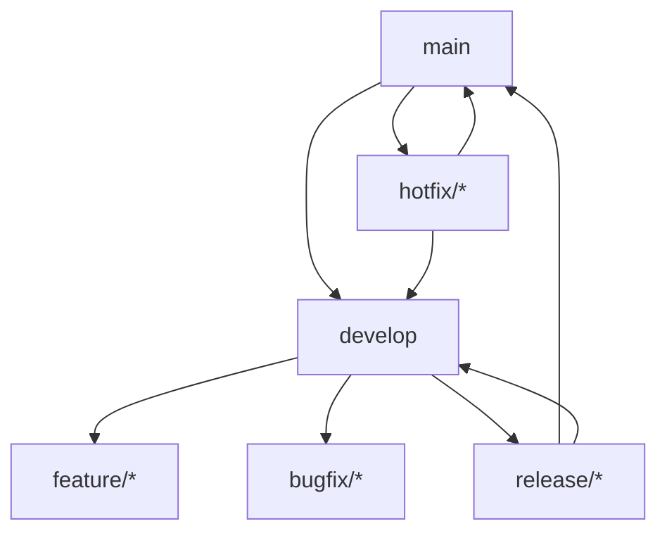

# 🌿 Git Flow - Процесс работы с Git

## 📋 Содержание
- [Основные принципы](#основные-принципы)
- [Структура веток](#структура-веток)
- [Правила именования](#правила-именования)
- [Процесс работы](#процесс-работы)
- [Коммиты](#коммиты)
- [Pull Request](#pull-request)
- [Релизный процесс](#релизный-процесс)
- [Команды](#команды)
- [Чек-листы](#чек-листы)

---

## 🎯 Основные принципы

| Принцип | Описание |
|---------|----------|
| **Одна ветка - одна задача** | Никаких сторонних изменений в ветке |
| **Маленькие коммиты** | Коммитить часто, но осмысленно |
| **Ветки живут недолго** | Максимум 2-3 дня, иначе мержить main |
| **Code review обязателен** | Никакого прямого пуша в main |
| **Все тесты должны проходить** | Перед мержем CI должен быть зеленым |

---

## 🌳 Структура веток



### Постоянные ветки

| Ветка | Назначение | Защита |
|-------|------------|--------|
| **`main`** | Продакшен, стабильная версия | 🔒 Только через PR, требует approval |
| **`develop`** | Разработка, интеграция фич | 🔒 Только через PR |

### Временные ветки

| Тип | Префикс | От кого | Куда | Назначение |
|-----|---------|---------|------|------------|
| **Feature** | `feature/` | `develop` | `develop` | Новая функциональность |
| **Bugfix** | `bugfix/` | `develop` | `develop` | Исправление багов в разработке |
| **Hotfix** | `hotfix/` | `main` | `main` + `develop` | Срочные исправления на проде |
| **Release** | `release/` | `develop` | `main` + `develop` | Подготовка релиза |
| **Docs** | `docs/` | `develop` | `develop` | Изменения документации |
| **Refactor** | `refactor/` | `develop` | `develop` | Рефакторинг кода |
| **Test** | `test/` | `develop` | `develop` | Добавление тестов |

---

## 📏 Правила именования

### Формат
```
{тип}/{issue-number}-{краткое-описание}
```

### Примеры
```bash
# ✅ Правильно
feature/PAY-123-add-payment-validation
bugfix/PAY-456-fix-null-reference
hotfix/PAY-789-critical-security-patch
release/v1.2.0
docs/update-readme-api-section

# ❌ Неправильно
feature/new-feature           # Без issue
bugfix/fix-bug                # Непонятно что
my-branch                     # Непонятно зачем
vasya/fixes                   # Личное имя
```

### Допустимые символы
- Латинские буквы в нижнем регистре
- Цифры
- Дефисы (`-`) между словами
- Слеши (`/`) для разделения типа и имени

---

## 🔄 Процесс работы

### 1. Начало работы над задачей

```bash
# Переключиться на актуальную develop
git checkout develop
git pull origin develop

# Создать ветку для задачи
git checkout -b feature/PAY-123-add-payment-validation

# Связать с issue (если используете)
# В названии ветки уже есть номер задачи
```

### 2. В процессе разработки

```bash
# Делать маленькие коммиты
git add src/services/payment/PaymentService.cs
git commit -m "feat: add payment validation method"

# Регулярно пушить
git push origin feature/PAY-123-add-payment-validation

# Обновлять ветку от develop (если долго работаете)
git fetch origin
git merge develop
# или rebase (если нет конфликтов)
git rebase develop
```

### 3. Завершение работы

```bash
# Убедиться, что все изменения закоммичены
git status

# Последний раз обновить от develop
git fetch origin
git rebase develop

# Запушить финальную версию
git push origin feature/PAY-123-add-payment-validation

# Создать Pull Request (через интерфейс GitHub)
```

---

## 💬 Коммиты

### Формат коммита
```
{тип}({область}): {краткое описание}

{подробное описание (опционально)}

{ссылка на issue}
```

### Типы коммитов

| Тип | Назначение | Пример |
|-----|------------|--------|
| **feat** | Новая функциональность | `feat(payment): add apple pay support` |
| **fix** | Исправление бага | `fix(auth): fix null reference in login` |
| **docs** | Документация | `docs(readme): update installation guide` |
| **style** | Форматирование | `style: fix indentation in PaymentService` |
| **refactor** | Рефакторинг | `refactor(api): extract validation logic` |
| **test** | Тесты | `test(payment): add unit tests for validator` |
| **chore** | Обслуживание | `chore: update dependencies` |
| **perf** | Производительность | `perf(db): optimize user query` |
| **ci** | CI/CD | `ci: add github actions workflow` |
| **revert** | Откат изменений | `revert: revert commit abc123` |

### Примеры

```bash
# Простой коммит
git commit -m "feat(payment): add payment validation"

# Коммит с описанием
git commit -m "feat(payment): add payment validation

- Add PaymentValidator class
- Implement amount validation
- Add currency code check
- Unit tests included

Closes #123"
```

### Правила хороших коммитов

✅ **Правильно:**
- `feat(auth): add password reset functionality`
- `fix(api): handle null response from external service`
- `docs(readme): update API endpoints documentation`

❌ **Неправильно:**
- `fix bug` - слишком обще
- `asdf` - бессмысленно
- `wip` - не для main
- `updated files` - что именно?

---

## 🔀 Pull Request

### Шаблон PR

```markdown
## 📋 Описание
{Краткое описание изменений}

## 🔗 Связанные задачи
- Closes #123
- Related to #456

## 🧪 Как тестировать
1. Запустить `make test`
2. Отправить POST на `/api/payments`
3. Проверить ответ

## ✅ Чек-лист
- [ ] Код соответствует стандартам
- [ ] Тесты написаны/обновлены
- [ ] Документация обновлена
- [ ] CI проходит успешно
- [ ] Нет конфликтов с develop

## 📸 Скриншоты
{если есть UI изменения}

## 📚 Связанные документы
- [ADR-0012](../architecture/adr/0012-payment-validation.md)
- [Требование FR-005](../requirements/functional/05-payments.md)
```

### Правила PR

| Правило | Описание |
|---------|----------|
| **Размер** | Не более 400 строк изменений |
| **Заголовок** | Должен отражать суть |
| **Описание** | Что, как, почему |
| **Тесты** | Обязательны для новой логики |
| **Комментарии** | Объяснить сложные места |
| **Скриншоты** | Для UI изменений |

### Кто ревьюит

| Тип изменений | Ревьюеры |
|---------------|----------|
| **Backend** | @backend-team |
| **Frontend** | @frontend-team |
| **Database** | @dba-team |
| **Архитектура** | @architects |
| **Документация** | @tech-writers |

---

## 📦 Релизный процесс

### 1. Создание релизной ветки

```bash
# Из develop
git checkout develop
git pull origin develop

# Создать релизную ветку
git checkout -b release/v1.2.0

# Обновить версию в проекте
# например, в package.json, .csproj и т.д.

git commit -m "chore(release): bump version to 1.2.0"
git push origin release/v1.2.0
```

### 2. Подготовка релиза

- Только багфиксы, документация
- Никаких новых фич
- Обновление CHANGELOG.md

### 3. Мерж в main

```bash
# PR из release/v1.2.0 в main
# После аппрува и прохождения тестов

git checkout main
git pull origin main
git merge --no-ff release/v1.2.0
git tag -a v1.2.0 -m "Release version 1.2.0"
git push origin main --tags
```

### 4. Мерж обратно в develop

```bash
git checkout develop
git pull origin develop
git merge --no-ff release/v1.2.0
git push origin develop

# Удалить релизную ветку
git branch -d release/v1.2.0
git push origin --delete release/v1.2.0
```

---

## 🔥 Hotfix процесс

### Для срочных исправлений на проде

```bash
# Из main
git checkout main
git pull origin main

# Создать hotfix ветку
git checkout -b hotfix/PAY-789-critical-security-patch

# Исправить баг
git add .
git commit -m "fix: critical security patch"

# Протестировать локально
make test

# Мерж в main
git checkout main
git merge --no-ff hotfix/PAY-789-critical-security-patch
git tag -a v1.2.1 -m "Hotfix v1.2.1"
git push origin main --tags

# Мерж в develop
git checkout develop
git merge --no-ff hotfix/PAY-789-critical-security-patch
git push origin develop

# Удалить hotfix ветку
git branch -d hotfix/PAY-789-critical-security-patch
git push origin --delete hotfix/PAY-789-critical-security-patch
```

---

## 📝 Полезные команды

### Настройка Git

```bash
# Настроить имя и email
git config --global user.name "Иван Петров"
git config --global user.email "ivan@company.com"

# Настроить редактор
git config --global core.editor "code --wait"

# Алиасы (сокращения)
git config --global alias.co checkout
git config --global alias.br branch
git config --global alias.ci commit
git config --global alias.st status
git config --global alias.unstage 'reset HEAD --'
git config --global alias.last 'log -1 HEAD'
```

### Рабочие команды

```bash
# Показать граф веток
git log --graph --oneline --all

# Отменить последний коммит (локально)
git reset --soft HEAD~1

# Отменить изменения в файле
git checkout -- filename.cs

# Спрятать временные изменения
git stash
git stash pop

# Посмотреть что изменилось
git diff
git diff --staged

# Интерактивный rebase
git rebase -i HEAD~3
```

---

## ✅ Чек-листы

### Перед созданием ветки
- [ ] Я обновил `develop` до последней версии
- [ ] Ветка названа по правилам
- [ ] Задача есть в трекере

### Перед коммитом
- [ ] Код отформатирован
- [ ] Тесты проходят локально
- [ ] Нет лишних файлов
- [ ] Коммит сообщение по правилам

### Перед созданием PR
- [ ] Ветка обновлена от `develop`
- [ ] Все тесты проходят в CI
- [ ] Добавлены/обновлены тесты
- [ ] Добавлена документация
- [ ] Нет конфликтов
- [ ] PR описан по шаблону

### На code review
- [ ] Ответить на комментарии
- [ ] Исправить замечания
- [ ] Не мержить до аппрува
- [ ] Обновить ветку если были изменения

---

## 🚫 Что НЕЛЬЗЯ делать

❌ **Никогда:**
- Пушить в `main` напрямую
- Пушить в `develop` напрямую
- Мержить без code review
- Игнорировать красные тесты
- Оставлять конфликты
- Делать большие PR (>400 строк)
- Использовать `git push --force` в общих ветках

⚠️ **С осторожностью:**
- `git rebase` в общих ветках
- `git reset --hard` (только локально)
- `git push --force-with-lease` (только в своих ветках)
